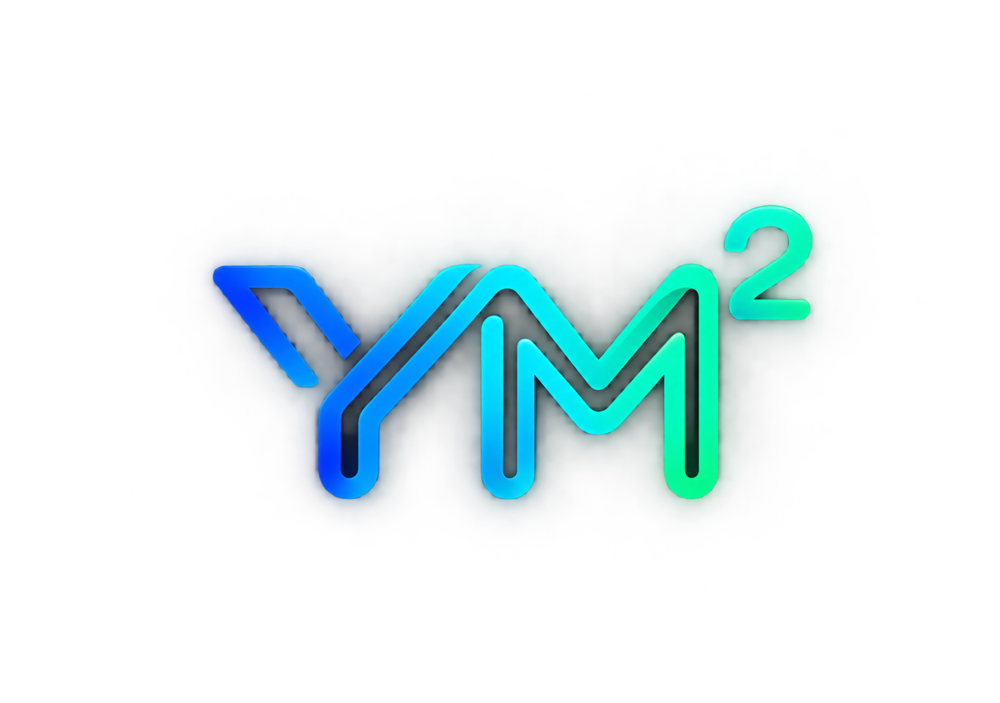

<p align="center">
  
</p>

<p align="center">
  Marketing website for <strong>YM² (Your Money Matters)</strong> — a private, offline-first, AI-assisted personal finance manager for Android.
</p>

<p align="center">
  <a href="https://prabhalabs.github.io/ymsquared/">Live site</a> ·
  Built with Vue 3, TypeScript, Vite, and Tailwind CSS
</p>

---

## Tech stack

- [Vue 3](https://vuejs.org/) (Composition API, `<script setup>`)
- [TypeScript](https://www.typescriptlang.org/) (strict)
- [Vite](https://vite.dev/)
- [Tailwind CSS v4](https://tailwindcss.com/) via `@tailwindcss/vite`
- [Vue Router](https://router.vuejs.org/) (history mode)
- [Heroicons](https://heroicons.com/) + [Lucide](https://lucide.dev/)

No Bootstrap, no Vuetify, no Nuxt, no UI/animation libraries — motion is CSS
and `<Transition>` only.

## Project structure

```
ymsquared-web/
├── public/               # static files copied as-is (favicon, og-image, 404.html, robots.txt, sitemap.xml)
├── src/
│   ├── assets/brand/     # source brand images (logo, icon)
│   ├── components/       # reusable UI building blocks
│   ├── composables/      # useScrollReveal, useSeoMeta
│   ├── layouts/          # DefaultLayout (navbar + page transition + footer)
│   ├── pages/            # HomePage, PrivacyPage, SupportPage, TermsPage, NotFoundPage
│   ├── router/           # route definitions
│   ├── types/            # shared TS interfaces
│   ├── App.vue
│   ├── main.ts
│   └── style.css         # Tailwind import + theme tokens + motion primitives
├── tailwind.config.ts
├── vite.config.ts
└── .github/workflows/deploy.yml
```

## Local development

Requires Node.js `^22.18.0` or `>=24.12.0`.

```sh
npm install
npm run dev        # start the dev server
npm run build       # type-check + production build to dist/
npm run preview      # preview the production build locally
```

## Deploying to GitHub Pages

The site is configured to deploy to a **project page**
(`https://<user>.github.io/<repo>/`), which requires two things to line up:

1. **Vite's `base` path** must match the repo name. `vite.config.ts` reads it
   from the `VITE_BASE_PATH` env var (defaulting to `/` for local dev):

   ```ts
   const base = process.env.VITE_BASE_PATH ?? '/'
   ```

2. **Client-side routing on a static host.** GitHub Pages has no
   server-side rewrites, so a hard refresh on a route like `/privacy` would
   normally 404. This repo ships the standard
   [`spa-github-pages`](https://github.com/rafgraph/spa-github-pages)
   redirect: `public/404.html` encodes the requested path into a query
   string and redirects to `index.html`, which decodes it back via
   `history.replaceState` before Vue Router boots (see the inline script in
   `index.html`'s `<head>`).

### Automated deploy (recommended)

`.github/workflows/deploy.yml` builds and deploys the site on every push to
`main`, using GitHub's official Pages Actions (`actions/upload-pages-artifact`
+ `actions/deploy-pages`) — no `gh-pages` branch or personal access token
needed.

One-time setup on GitHub:

1. Go to the repo's **Settings → Pages**.
2. Under **Build and deployment → Source**, select **GitHub Actions**.
3. Push to `main` — the workflow builds with `VITE_BASE_PATH=/ymsquared/` and
   publishes `dist/` automatically.

If you fork this repo or rename it, update `VITE_BASE_PATH` in
`.github/workflows/deploy.yml` (and the canonical/OG URLs in `index.html`) to
match your GitHub username and repo name.

### Manual deploy (alternative)

```sh
VITE_BASE_PATH=/ymsquared/ npm run build
npx gh-pages -d dist
```

This pushes `dist/` to a `gh-pages` branch; set the Pages source to that
branch instead of "GitHub Actions" if you use this route.

## Brand assets

Source brand files live in `src/assets/brand/` (`icon.png`, `logo-light.png`,
`logo-dark.png`) and are the single source of truth. Derived files in
`public/` (`favicon.ico`, `apple-touch-icon.png`, `icon.png`, `og-image.png`)
were generated from `icon.png`. Run `node scripts/generate-brand-assets.mjs`
(after `npm install -D sharp png-to-ico`) to regenerate everything from the
source artwork if it changes — see the script's comments for the crop/
flatten decisions baked into it.

- `logo-light.png` — the YM² wordmark on its own opaque black background,
  for use on the site's dark surfaces (navbar, footer).
- `logo-dark.png` — the same wordmark composited onto a white rounded
  card, for use on light surfaces (e.g. this README, rendered on GitHub's
  white background).
- `icon.png` — the app mark alone (letterboxed to a square, opaque black
  background); source for the favicon, touch icon, and OG image.

## Spec-driven development

This project uses [OpenSpec](https://github.com/Fission-AI/OpenSpec) for
spec-driven changes. See `openspec/changes/archive/2026-08-08-mflow-marketing-site/`
for the original build's proposal/specs/design/tasks, and
`openspec/changes/rebrand-ym-squared/` for the YM² rebrand.
